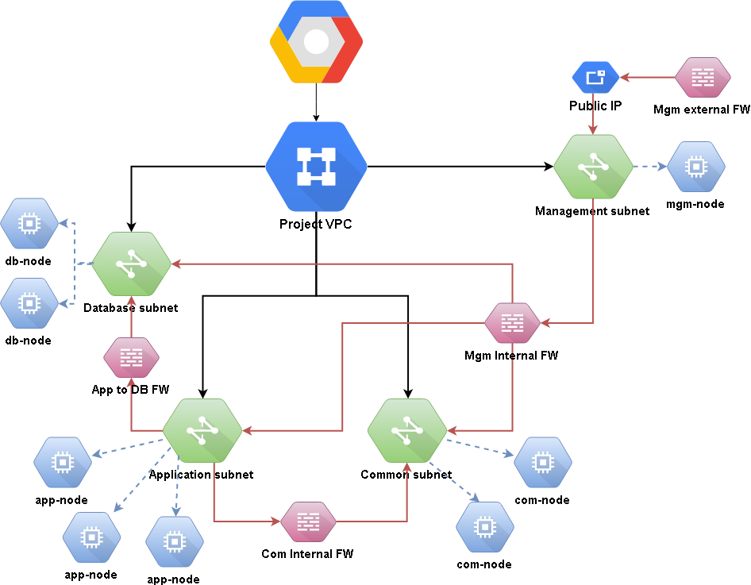

# Google Cloud - Fullstack infrastructure

``Version 1.0.0``  

## Description
Simple terraform code which will build base infrastructure to deploy your applications, including database, support services and access management

`Management Subnet`  
Separate subnet for management host/s. Purpose of management host is to provide controled acces point to your infrastructure, serving as access or jump host from Public IP or VPN

`Application Subnet`  
Subnet for application host with controlled firewall access, with ssh access only from management subnet.

`Common Subnet`  
Subnet for common host, which served as place to deploy support services such as monitoring, logging, orchestration, version control, repos, etc. Access is controlled by firewalls.

`Database Subnet`  
Subnet for database host (self build~, not cloud PaaS) with controlled firewall access, allowing database connection only from application subnet and ssh acces only from management.

## Structure

```
gcloud-fullstack-infra
    secret
      |— fullstack-infra.json
    |— firewall.tf
    |— network.tf
    |— vm.tf
    |— provider.tf
    |— outputs.tf
    |— variables.tf
```


## Usage

``note:`` nomad.json,my_id_rsa,my_id_rsa.pub are just dummy empty files. You will need to replace them with your own.

You will need to generate SSH keys as follows:

```sh
$ ssh-keygen -f ./secret/my_id_rsa
# press <Enter> when asked (twice) for a pass-phrase
```

Then [download your credentials from Google Cloud Console](https://www.terraform.io/docs/providers/google/#credentials); suggested path for downloaded file is `./secret/fulstack-infra.json`.

Create `terraform.tfvars` file with your project variables. YOu can use `terrraform.tfvars.example` as template.

After you run `terraform apply` on this configuration, it will
automatically output the public IP address of all hosts.

## Maintainer
`Simian Labs` - (https://github.com/simianlabs)  
http://simianlabs.io || sl@simianlabs.io